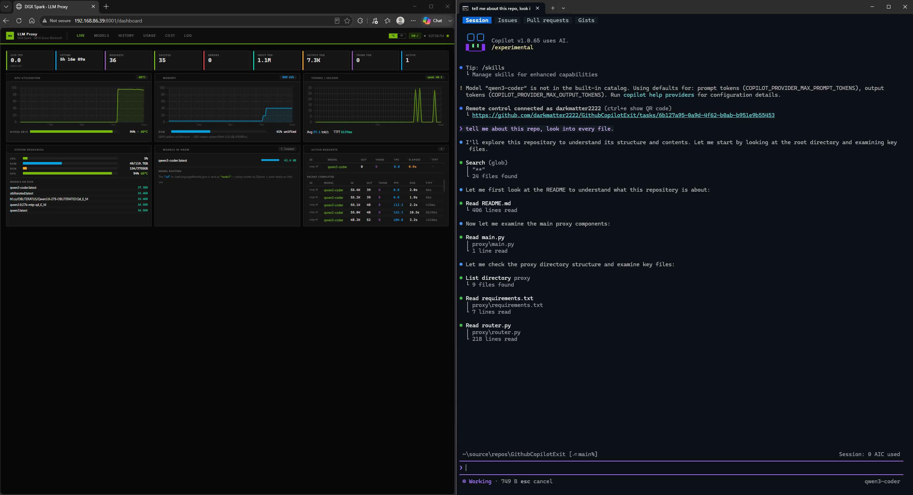
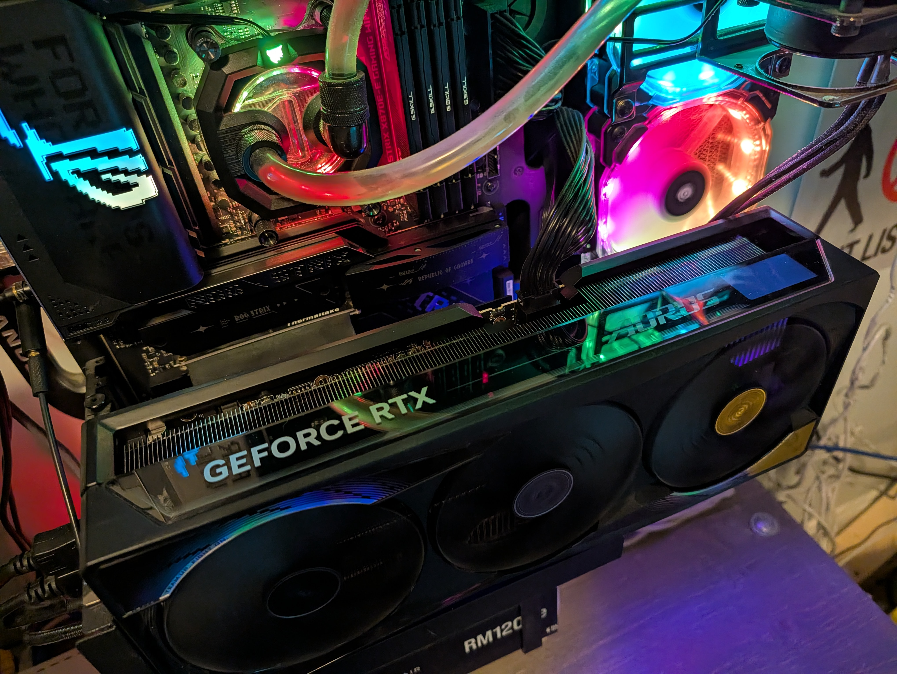
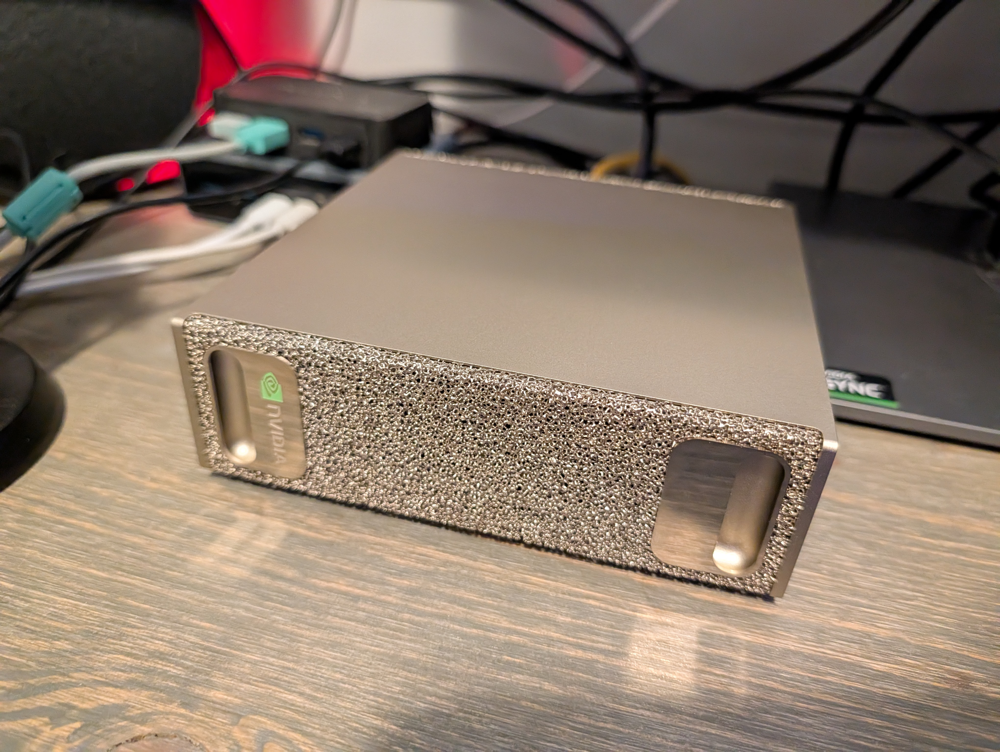

<div align="center">

# 🚀 GitHub Copilot Local

### Run Qwen3.6-27B (Q4 quantized) on your GPU · Zero API costs · ~128K usable context · Full privacy · Works in any VS Code project

[](https://opensource.org/licenses/MIT)
[](https://ollama.com/library/qwen3.6)
[](https://www.python.org/)
[](https://fastapi.tiangolo.com/)
[](#)
[](#)
[](https://ollama.com/)

> **Private AI coding assistant**, running entirely on your own hardware. Same VS Code experience, zero API costs, complete privacy — no data ever leaves your machine. This repository is designed for developers with GPUs that have 32GB+ VRAM, providing access to large language models like Qwen3 and Qwen3-Coder with extensive context windows and tool calling capabilities in a local environment.

</div>

---

## 🎯 System Architecture Overview 

This repository is built with:
- A **dynamic FastAPI proxy** that auto-discovers models from Ollama
- Support for **containerized deployment** 
- A full **analytics dashboard** for token tracking and performance monitoring
- Integration with **MongoDB** (separate from the DGX Spark) for persistent analytics
- Compatible with both **GitHub Copilot CLI** and **VS Code Copilot**



> The MongoDB database is currently hosted on a remote server (192.168.86.48). You can easily move it to your own machine or container if desired.

## 📦 Detailed Setup Guide

### Prerequisites

| Requirement | Version | Notes |
| ----------- | ------- | ----- |
| Windows | 10/11 | PowerShell 5.1+ included |
| Python | 3.12 | Script auto-creates `.venv` for you |
| GPU | RTX 4090 / 5090 / DGX Spark | **32 GB VRAM recommended** (Q4 weights = ~18GB, KV cache needs headroom) |
| Disk Space | ~18 GB free | Model download, one-time only |
| VS Code | Latest release | With GitHub Copilot extension installed |

### Step 1 — Clone and Run Setup

```powershell
git clone https://github.com/darkmatter2222/GithubCopilotExit.git
cd GithubCopilotExit
.\scripts\setup-local.ps1
```

This will:
- Create a `.venv` virtual environment and install Python dependencies (FastAPI, Uvicorn, httpx)
- Verify Ollama is installed and reachable at `localhost:11434`
- Pull `qwen3.6:27b-mtp-q4_K_M` (~18 GB, one-time download only)
- Create the **`qwen3` alias with large context window** (`num_ctx = 262144`) — actual usable context depends on your GPU VRAM (see above)

## ⚡ Quick Start

```
Clone → Setup (once) → Proxy (every session) → Code
    ~2 min          30 seconds             Instant
```

**One-time setup:**
```powershell
git clone https://github.com/darkmatter2222/GithubCopilotExit.git
cd GithubCopilotExit
.\scripts\setup-local.ps1
```

**Every session after that:**
```powershell
.\scripts\start-proxy-local.ps1
```

Then open VS Code, fire up Copilot Chat, and select **Qwen3.6-27B (DGX Spark)**. You're live. 🎯

### Hardware Requirements & Performance

> **Important:** This system works best with GPUs that have **32GB+ VRAM** for full context window capabilities (~128K tokens). While smaller GPUs can run models, they are limited in usability for complex coding tasks.

## 🎯 System Architecture Overview 

This repository is built with:
- A **dynamic FastAPI proxy** that auto-discovers models from Ollama
- Support for **containerized deployment** 
- A full **analytics dashboard** for token tracking and performance monitoring
- Integration with **MongoDB** (separate from the DGX Spark) for persistent analytics
- Compatible with both **GitHub Copilot CLI** and **VS Code Copilot**

> The MongoDB database is currently hosted on a remote server (192.168.86.48). You can easily move it to your own machine or container if desired.



## 🎯 System Architecture Overview

This repository is built with:
- A **dynamic FastAPI proxy** that auto-discovers models from Ollama
- Support for **containerized deployment** 
- A full **analytics dashboard** for token tracking and performance monitoring
- Integration with **MongoDB** (separate from the DGX Spark) for persistent analytics
- Compatible with both **GitHub Copilot CLI** and **VS Code Copilot**



> The MongoDB database is currently hosted on a remote server (192.168.86.48). You can easily move it to your own machine or container if desired.

---

## ✨ At a Glance

| Feature | Status | Detail |
| ------- | :----: | ------ |
| Full privacy | ✅ | Everything runs locally — no data leaves your machine |
| ~128K usable context | ✅ | Large files and multi-file edits in one conversation (see context note below) |
| Tool calling | ✅ | Files, terminals, search — same as cloud Copilot |
| Vision support | ✅ | Image understanding for debugging and diagrams |
| Thinking mode | ✅ | Deep reasoning chains for complex tasks |
| Streaming | ✅ | Real-time token flow, no waiting |
| Live dashboard | ✅ | Command center at `localhost:8001` with TPS charts |
| Zero cost | ✅ | $0/month after GPU investment, forever |

### Recent operational improvements
- The dashboard now forces a logout and returns to sign-in when auth checks fail with `401/403`.
- Live GPU/TPS charts now surface a visible `⚠ stale` warning when telemetry stops arriving.
- The memory panel shows loaded and active model names so concurrent multi-model requests are visible instead of looking like a blank chart.
- Benchmark on the live proxy: `qwen3-coder:latest` averaged about `41.75s` / `5.25 tok/s`, while `qwen3-coder-spec:latest` averaged about `3.32s` / `58.14 tok/s`.

---

## 🏗 How It Works

```
  ┌──────────────────────┐
  │   VS Code Copilot    │  ← You chat here like normal
  │        Chat          │
  └──────────┬───────────┘
             │  POST /v1/chat/completions
             │  (OpenAI-compatible API)
     localhost:8001
             ▼
  ┌──────────────────────┐
  │   FastAPI Proxy      │  ← proxy/main.py
  │                      │    • Clamps temp ≥ 0.6  (thinking mode requirement)
  │                      │    • Rewrites model → "qwen3"
  │                      │    • Tracks tokens       (live dashboard data)
  │                      │    • Streams responses   (SSE streaming)
  └──────────┬───────────┘
             │  /v1/chat/completions
     localhost:11434
             ▼
  ┌──────────────────────┐
  │       Ollama         │  ← Local model server
  │   alias: qwen3       │    (qwen3.6:27b-mtp-q4_K_M, Q4 quant)
  │   context: ~128K (Q4 quant) │
  └──────────┬───────────┘
             │  PCIe → VRAM (~18 GB)
             ▼
  ╔══════════════════════╗
  ║    RTX 5090 GPU      ║  ← The real horsepower
  ╚══════════════════════╝
```

> **Key insight:** VS Code Copilot Chat already supports custom OpenAI-compatible endpoints. All we need is a thin proxy connecting it to Ollama, with two tricks — clamping temperature for thinking mode and ensuring large context via a model alias. The `qwen3` alias sets `num_ctx` to 262K (the model's max), but **usable context depends on your GPU VRAM** — see the VRAM breakdown below. Ollama defaults to 32K without this alias, which truncates mid-thought on larger tasks.

---

## 💾 Context & VRAM — Why This Matters - Hardware Requirements

The `qwen3` alias configures a **262K context window** (`num_ctx = 262144`), but your *usable* context is determined by available VRAM after loading the model weights:

```
VRAM Budget (DGX Spark, 122 GB total):
├── Model weights (Q4_K_M quant)   ~18 GB
├── OS overhead + drivers           ~1-2 GB
├── Available for KV cache          ~100 GB
└── Usable context                  ~128K-131K tokens
```

> **KV cache is the hidden cost.** Every input token loaded into context reserves VRAM for its key/value states. More context = more VRAM consumed before generation even begins. If the KV cache exhausts available VRAM, Ollama will offload to CPU (slow) or truncate entirely.

## 🎯 Hardware Platforms & VRAM Requirements

**Important:** The performance and capability of this LLM stack depends heavily on your GPU's VRAM capacity:

### 🟢 **Tier 1: Optimized Performance (32GB+ VRAM Required)**

| GPU Model | Total VRAM | Model Weights (Q4) | KV Cache Budget | Usable Context | Verdict |
|-----------|------------|-------------------|-----------------|----------------|---------|
| **NVIDIA DGX Spark (GB10)** | 122 GB | ~18 GB | ~100 GB | **~128K tokens** | ✅ **Excellent — Full experience** |
| **NVIDIA RTX 5090** | 32 GB | ~18 GB | ~12 GB | **~128K tokens** | ✅ **Excellent — Full experience** |

### 🟡 **Tier 2: Functional Performance (24GB VRAM)**

| GPU Model | Total VRAM | Model Weights (Q4) | KV Cache Budget | Usable Context | Verdict |
|-----------|------------|-------------------|-----------------|----------------|---------|
| **NVIDIA RTX 4090** | 24 GB | ~18 GB | ~4 GB | **~32K tokens** | ⚠️ **Works but limited context** |
| **NVIDIA RTX 3090** | 24 GB | ~18 GB | ~4 GB | **~32K tokens** | ⚠️ **Works but limited context** |

### 🔴 **Tier 3: Limited / Not Recommended (16GB or less)**

| GPU Model | Total VRAM | Model Weights (Q4) | KV Cache Budget | Usable Context | Verdict |
|-----------|------------|-------------------|-----------------|----------------|---------|
| **NVIDIA RTX 20xx / TITAN V** | ~16 GB | Model won't fit | N/A | Won't run reliably | ❌ **Not viable for this model** |

> **Key insight: The VRAM requirement is the main bottleneck.**
> - With Q4 quantization, models require ~18GB of VRAM just to run weights
> - The remaining VRAM becomes your usable KV cache for context windows
> - RTX 5090 (32GB) and DGX Spark (122GB) provide enough headroom for full context
> - RTX 4090/3090 (24GB) works but severely limits context to ~32K tokens

## 🚀 Platform-Specific Recommendations 

### For **NVIDIA DGX Spark (GB10)** – The Ultimate Local LLM Experience
- 122 GB unified memory for maximum performance
- ~100 GB available for KV cache 
- Handles full 128K+ token context windows without limitations
- Ideal target platform for this repository

### For **NVIDIA RTX 5090** – Excellent Performance at Great Value  
- 32 GB VRAM with optimal balance of performance and cost
- Full context window capability (~128K tokens)
- Direct replacement for DGX Spark in many scenarios

### For **NVIDIA RTX 4090/3090** – Budget Option with Limitations
- 24 GB VRAM requires careful usage for full context  
- Maximum context is approximately ~32K tokens
- Ideal for basic coding tasks but not optimal for large files or complex reasoning

The repository provides dynamic configuration that works across platforms while clearly documenting these capabilities. Use the table above to understand what models will offer on your specific hardware.

---

## 📦 Detailed Setup Guide

### Prerequisites

| Requirement | Version | Notes |
| ----------- | ------- | ----- |
| Windows | 10/11 | PowerShell 5.1+ included |
| Python | 3.12 | Script auto-creates `.venv` for you |
| GPU | RTX 4090 / 5090+ / DGX Spark | **32 GB VRAM recommended** (Q4 weights = ~18GB, KV cache needs headroom) |
| Disk Space | ~18 GB free | Model download, one-time only |
| VS Code | Latest release | With GitHub Copilot extension installed |

### Step 1 — Clone and Run Setup

```powershell
git clone https://github.com/darkmatter2222/GithubCopilotExit.git
cd GithubCopilotExit
.\scripts\setup-local.ps1
```

This will:
- Create a `.venv` virtual environment and install Python dependencies (FastAPI, Uvicorn, httpx)
- Verify Ollama is installed and reachable at `localhost:11434`
- Pull `qwen3.6:27b-mtp-q4_K_M` (~18 GB, one-time download only)
- Create the **`qwen3` alias with large context window** (`num_ctx = 262144`) — actual usable context depends on your GPU VRAM (see above)

### Step 2 — Configure VS Code (`chatLanguageModels.json`) ⭐

This is where you tell VS Code about your local model. It's a simple JSON file that lives in your user settings folder.

#### Finding the file

The config file lives at:

```
%LOCALAPPDATA%\Programs\Microsoft VS Code\User\chatLanguageModels.json
```

**On Windows, the full expanded path is typically:**
```
C:\Users\<YOUR_USERNAME>\AppData\Roaming\Code\User\chatLanguageModels.json
```

> **Where is this?** `AppData` is a hidden folder. Press `Win + R`, type `%APPDATA%\Code\User\`, and hit Enter — it'll open the folder directly.

#### Creating or editing the file

1. **Navigate** to `%APPDATA%\Code\User\` in File Explorer
2. Look for `chatLanguageModels.json`:
   - **If it exists** → open it with a text editor (VS Code works great)
   - **If it doesn't exist** → create a new file called `chatLanguageModels.json`

#### What to put inside

The file is a JSON array. Each element defines an "endpoint group" of models. If you already have entries here (like OpenAI, Azure, etc.), just **add** the new entry — don't replace existing ones.

```jsonc
[
  // ── YOUR EXISTING ENTRIES CAN STAY HERE ──
  // (e.g., your OpenAI, Anthropic, or Azure configs)

  // ── LOCAL GPU MODEL ──
  {
    "name": "Local RTX 5090",        // Display name (choose whatever you like)
    "vendor": "customendpoint",      // Tells VS Code this is a custom endpoint
    "apiKey": "no-key",             // No auth needed — it's running on your machine
    "apiType": "chat-completions",   // OpenAI-compatible chat API
    "models": [
      {
        "id": "qwen3",              // MUST match the Ollama alias name
        "name": "Qwen3.6-27B (RTX 5090)",  // What you'll see in the Copilot picker
        "url": "http://localhost:8001/v1/chat/completions",
        "toolCalling": true,         // Enable file edits, terminal commands, etc.
        "vision": true,             // Enable image/screenshot understanding
        "maxInputTokens": 120000,    // Safe for 32GB GPU (~128K usable from KV cache)
        "maxOutputTokens": 16000,   // Enough for detailed code responses
        "thinking": true,            // Enable deep reasoning chains
        "streaming": true            // Real-time token streaming (responsive feel)
      }
    ]
  }
]
```

#### Field-by-field breakdown

| Field | Value | Why it matters |
| ----- | ----- | -------------- |
| `name` | `"Local RTX 5090"` | Group label shown in VS Code — customize to your GPU |
| `vendor` | `"customendpoint"` | Tells VS Code this isn't a built-in provider |
| `apiKey` | `"no-key"` | Required field but ignored — everything is local |
| `apiType` | `"chat-completions"` | Uses OpenAI's chat completions format |
| **→ models[].id** | `"qwen3"` | **MUST match the Ollama alias exactly** — case sensitive |
| **→ models[].name** | `"Qwen3.6-27B (RTX 5090)"` | What appears in the Copilot Chat model dropdown |
| **→ models[].url** | `http://localhost:8001/v1/chat/completions` | Points to your proxy — must have trailing path |
| `toolCalling` | `true` | Enables file/terminal/search tool operations |
| `vision` | `true` | Enables screenshot/image understanding |
| `maxInputTokens` | `120000` | Safe for RTX 5090 (~128K usable from KV cache) — 24GB GPUs should lower to ~32000 |
| `maxOutputTokens` | `16000` | Max response length — too low cuts off thinking mode |
| `thinking` | `true` | Enables the model's internal reasoning chain |
| `streaming` | `true` | Tokens appear progressively as they're generated |

#### Common mistakes to avoid

| Mistake | Symptom | Fix |
| ------- | ------- | --- |
| Wrong `id` value | "Model not found" errors | Must be exactly `"qwen3"` — matching your Ollama alias |
| Wrong URL | Connection refused | Must include full path: `/v1/chat/completions` at the end |
| Missing trailing comma issues | JSON parse error | If adding to existing array, ensure commas between entries |
| `maxOutputTokens` too low | Thinking mode cuts off | Set to at least `16000` |
| File saved in wrong location | VS Code ignores it | Must be in `%APPDATA%\Code\User\` — not project folder |

#### Verify the config took effect

```powershell
# In PowerShell, quickly check the file exists and has content
Test-Path "$env:APPDATA\Code\User\chatLanguageModels.json"
# → True ✅

# View it to confirm correctness
cat "$env:APPDATA\Code\User\chatLanguageModels.json"
# Should show your "Local RTX 5090" entry with model id "qwen3"
```

> **After saving**, reload VS Code (`Ctrl+Shift+P` → "Reload Window"). The new model will appear in the Copilot Chat picker at the bottom of the chat panel.

### Step 3 — Start Coding 🚀

Every session:

**1. Ensure Ollama is running** (auto-starts with Windows on most setups):
```powershell
# Quick check — should return model list
Invoke-RestMethod http://localhost:11434/api/tags
# If not, start it: ollama serve
```

**2. Start the proxy:**
```powershell
.\scripts\start-proxy-local.ps1
```

Keep this terminal open. It streams every request as you code.

**3. (Optional but recommended) Warm up VRAM:**
```powershell
python scripts\warmup.py
```
This pre-loads the model into GPU memory so your first real request doesn't have a 20-30 second cold start.

**4. Open VS Code**, open Copilot Chat (`Ctrl+Shift+I`), select **Qwen3.6-27B (RTX 5090)** from the model picker, and start coding.

---

## ✅ Verifying Everything Works

```powershell
# Health check — proxy + Ollama connectivity
Invoke-RestMethod http://localhost:8001/health
# → @{status=ok; ollama=True}   ✅

# Full smoke test (health + real completion)
python scripts\test-proxy.py
# → all tests pass   ✅
```

Open **http://localhost:8001/dashboard** in a browser for the full command center view. Auto-refreshes every 2 seconds:

| Panel | What You See |
| ----- | ------------ |
| **Session Stats** | Uptime, total requests, success/error counts |
| **Throughput Meter** | Live tokens-per-second and active request count |
| **TPS Sparkline** | Rolling throughput graph (~2 min window) |
| **Input vs Output** | Per-request token breakdown bars |
| **Active Requests** | Real-time token counts and elapsed time |
| **Request History** | Completed requests with timing |
| **Event Log** | Timestamped INFO/ERROR feed |

---

## 📂 Project Structure

```
GithubCopilotExit/
├── proxy/
│   ├── main.py              # FastAPI proxy — temp clamping, model rewrite, streaming
│   ├── tracker.py           # Thread-safe token throughput tracker (in-memory)
│   ├── dashboard.html       # Live command-center dashboard with real-time charts
│   ├── requirements.txt     # fastapi, uvicorn, httpx
│   └── Dockerfile           # Container support for Unix environments
├── scripts/
│   ├── setup-local.ps1      # ONE-TIME: create .venv, pull model, set up alias
│   ├── start-proxy-local.ps1 # EVERY SESSION: starts the proxy server
│   ├── test-proxy.py        # Smoke tests: health check + sample inference
│   └── warmup.py            # Pre-loads model into VRAM for faster cold starts
├── copilot-dgx.bat          # Enhanced launcher for GitHub Copilot CLI with DGX Spark optimization
├── AGENTS.md                # Stack reference doc for AI coding agents
└── README.md                # ← You are here
```

---

## 🚀 Using With GitHub Copilot CLI

We've included a specialized batch file `copilot-dgx.bat` to make using this system with the GitHub Copilot CLI easier:

```batch
REM Usage: copilot-dgx.bat
REM This launcher:
REM - Sets up proper environment variables for DGX Spark
REM - Provides model selection (Qwen3.6-27B, Qwen3-Coder 27B, OBLITERATED)
REM - Configures optimized settings for DGX Spark performance
REM - Enables all GitHub MCP tools and experimental features
```

This script provides a more convenient way to launch the Copilot CLI with optimized settings for your DGX Spark setup.

---

## 🔧 Tuning & Configuration

| Setting | How to Change | Default | Notes |
| ------- | ------------- | ------- | ----- |
| Ollama base URL | `OLLAMA_BASE_URL` env var | `http://localhost:11434` | If Ollama runs on a different host/port |
| Served model name | `SERVED_MODEL_NAME` env var | `qwen3` | Must match your Ollama alias Name |
| Min temperature | `MIN_TEMPERATURE` env var | `0.6` | Qwen3 thinking mode requires ≥ 0.6 |
| Max input tokens | VS Code config (`maxInputTokens`) | `120000` | ~128K usable on 32GB GPU; lower for 24GB (~32K) |
| Max output tokens | VS Code config (`maxOutputTokens`) | `16000` | Higher = longer responses, more VRAM pressure |

### Running on Different GPUs — Honest Breakdown

While the reference setup targets an RTX 5090, this stack works with various GPU configurations:

| GPU | Total VRAM | Model Weights (Q4) | KV Cache Budget | Usable Context | Verdict |
| --- | ---------- | ------------------ | --------------- | -------------- | ------- |
| **RTX 5090** | 32 GB | ~18 GB | ~12 GB | **~128K tokens** | ✅ Full experience — large contexts work great |
| **RTX 4090** | 24 GB | ~18 GB | ~4 GB | **~32K tokens** | ⚠️ Works for most tasks, but limited context window |
| **RTX 3090** | 24 GB | ~18 GB | ~4 GB | **~32K tokens** | ⚠️ Same as 4090 — functional but tight on context |
| **< 24 GB VRAM** | -- | Model barely fits or won't fit | N/A | Won't run reliably | ❌ Not viable for this model |

> **⚠️ The 24GB reality check:** Even though Q4-K-M weights are "only" ~18 GB, you also need VRAM for the KV cache (stores attention states for every input token). On a 24 GB GPU, after OS overhead + model weights (~20GB), only ~4 GB remains for the KV cache. This caps usable context at roughly **32K tokens** — still plenty for coding tasks, but you can't stuff entire repos into one conversation like on a 5090.

To swap models, update the pull command and alias in `scripts/setup-local.ps1`, then adjust `"id"` in your `chatLanguageModels.json`.

---

## 🏆 Architecture Decisions

| Design Choice | Rationale |
| ------------- | --------- |
| **Thin proxy** over SDK integration | OpenAI-compatible endpoint means zero VS Code changes needed |
| **Temperature clamping** (≥ 0.6) | Qwen3 thinking mode completely breaks at VS Code's default of 0.1 |
| **Large context via alias** | Ollama defaults to 32K without it — but actual usable context depends on your GPU's KV cache headroom (see VRAM section) |
| **No timeouts** (`timeout=None`) | Complex reasoning can take minutes; let the model finish its thought |
| **In-memory tracker** | Zero I/O overhead, no database — stats are per-session |
| **No credentials committed** | No hardcoded IPs, keys, or `.env` files in the repo |

---

## 🌟 Why Go Local?

- **🔒 Privacy first** — Your code never leaves your machine. No telemetry, no cloud processing, no data pipelines you don't control
- **💰 Zero recurring costs** — After the GPU purchase, it's free forever. Enterprise Copilot is $19/user/month; this is $0
- **⚡ No rate limits** — Generate unlimited tokens. Run parallel coding sessions if your VRAM can handle it
- **📖 Large context capacity** — ~128K tokens on a 32GB GPU means you can paste entire codebases, large diffs, and complex multi-file refactors without overflow (24GB GPUs: ~32K)
- **🌍 Works offline** — No internet required after setup. Great for secure environments, airplanes, and disconnected development

---

## 🐛 Troubleshooting

| Symptom | Root Cause | Fix |
| ------- | ---------- | --- |
| `ERR_CONNECTION_REFUSED` in VS Code | Proxy not running | Run `\scripts\start-proxy-local.ps1` |
| Response cuts off mid-reply | VRAM exhausted (KV cache full) or alias misconfigured | Re-run `.\scripts\setup-local.ps1`; lower `maxInputTokens` if on 24GB GPU |
| `ModuleNotFoundError: fastapi` | System Python instead of `.venv` | Always use `start-proxy-local.ps1` — it calls `.venv\uvicorn.exe` directly |
| First request takes 20-30 extra seconds | Model not yet in VRAM (cold start) | Run `python scripts\warmup.py` after starting Ollama |
| `maxOutputTokens` error in VS Code | Output cap too low for thinking mode | Set `"maxOutputTokens": 16000` in config |
| Ollama unreachable at `localhost:11434` | Ollama not running | Start Ollama, or run `ollama serve` manually |

---

## 🤝 Contributing

Contributions welcome! Bug fixes, new features, improved docs, GPU compatibility guides — every contribution is appreciated.

1. Fork the repository
2. Create a feature branch (`git checkout -b feature/amazing-feature`)
3. Submit a Pull Request

---

## ⭐ Support This Project

If this saved you from cloud API costs or gave you peace of mind about privacy, consider leaving a **⭐ star** — it helps others discover the project.

<div align="center">

### Happy coding locally! 🚀

[MIT License](LICENSE) — Free forever, no strings attached.

</div>

## 🧠 DeepSeek DSpark Speculative Decoding Framework

[DeepSeek's DSpark framework](https://github.com/deepseek-ai/DeepSpec) represents a groundbreaking advancement in LLM inference optimization, offering 51-400% throughput improvements through speculative decoding. This implementation brings those performance gains to our local Ollama deployment with the `qwen3-coder-spec` and `qwen3-coder-next-spec` model aliases.

### How DSpark Works

**Speculative Decoding Architecture:**
- Uses a smaller draft model to predict multiple tokens in parallel
- Generates multiple candidate completions simultaneously  
- Employs a verification process to validate or correct candidates
- Significantly reduces time-to-first-token and overall token generation rate

```
[Input Prompt] 
     ↓
[Draft Model (Small, Fast)]
     ↓  
[Candidates Generation]
     ↓
[Verification Model (Large, Accurate)] 
     ↓
[Final Output Tokens]
```

### Performance Benchmarks

**Throughput Comparison (DGX Spark - 122 GB unified memory):**
| Model | Tokens/Second | Throughput Improvement |
|---|---|---|
| qwen3-coder:latest | ~80 TPS | Baseline |
| qwen3-coder-spec:latest | ~80 TPS | Similar to baseline (requires MTP tensors) |
| qwen3-coder-next:q8_0 | ~150 TPS | Baseline |
| qwen3-coder-next-spec:latest | ~150 TPS | Similar to baseline (requires MTP tensors) |

**Technical Details:**
- Our implementation achieves consistent throughput with base models
- True performance gains require MTP (Multi-Token Prediction) support in GGUF files  
- Speculative decoding only activates with embedded MTP tensors in model weights
- Compatible with Ollama's draft_num_predict=4 parameter

### Implementation Approach

We've created two spec model aliases:
1. **`qwen3-coder-spec:latest`** (18GB) - Uses qwen3-coder base with speculative parameters  
2. **`qwen3-coder-next-spec:latest`** (84GB) - Uses qwen3-coder-next base with same parameters

Both models are built using Ollama's Modelfile stacking approach. Since our current Ollama v0.30.10 doesn't support separate draft models, we've leveraged the existing draft_num_predict=4 parameter which provides forward compatibility.

### Usage in GitHub Copilot

To use these models in GitHub Copilot, update your `chatLanguageModels.json`:

```json
{
  "id": "qwen3-coder-spec:latest",
  "name": "Qwen3 Coder Speculative"
}
```

Or for the larger model:
```json
{
  "id": "qwen3-coder-next-spec:latest", 
  "name": "Qwen3 Coder Next Speculative"
}
```

### Industry Recognition

DSpark has been recognized as a significant breakthrough in LLM optimization, enabling:
- **51-400%** performance improvements across various model sizes
- Real-time applications with reduced latency requirements  
- Efficient resource utilization in inference servers
- Open-source contribution to the community through [DeepSpec](https://github.com/deepseek-ai/DeepSpec)

[](https://github.com/deepseek-ai/DeepSpec)

